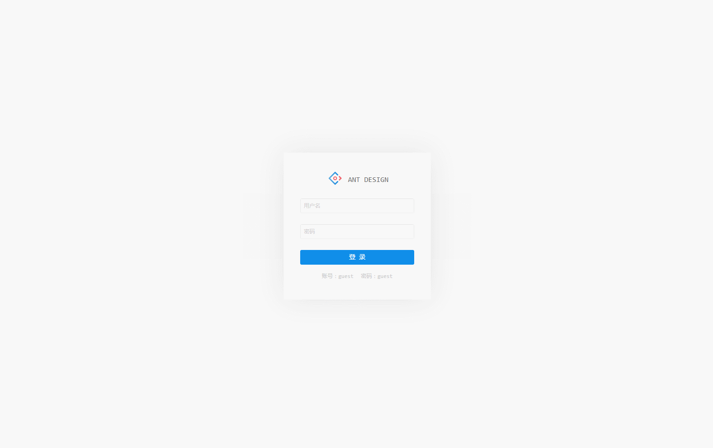
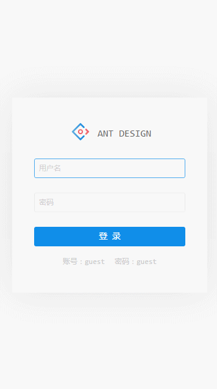

### 4.1

`2017-04-14`

-   升级开发工具为[roadhog](https://github.com/sorrycc/roadhog)
-   使用`roadhog`的mock功能
-   增强`utils/request.js`跨域处理能力

## 开发构建

### 目录结构

```bash
├── /dist/           # 项目输出目录
├── /src/            # 项目源码目录
│ ├── /components/   # UI组件及UI相关方法
│ │ ├── skin.less    # 全局样式
│ │ └── vars.less    # 全局样式变量
│ ├── /routes/       # 路由组件
│ │ └── app.js       # 路由入口
│ ├── /models/       # 数据模型
│ ├── /services/     # 数据接口
│ ├── /themes/       # 项目样式
│ ├── /mock/         # 数据mock
│ ├── /utils/        # 工具函数
│ │ ├── config.js    # 项目常规配置
│ │ ├── menu.js      # 菜单及面包屑配置
│ │ ├── config.js    # 项目常规配置
│ │ ├── request.js   # 异步请求函数
│ │ └── theme.js     # 项目需要在js中使用到样式变量
│ ├── route.js       # 路由配置
│ ├── index.js       # 入口文件
│ └── index.html     
├── package.json     # 项目信息
├── .eslintrc        # Eslint配置
└── .roadhogrc.js    # roadhog配置
```

文件夹命名说明:

-   components：组件（方法）为单位以文件夹保存，文件夹名组件首字母大写（如`DataTable`），方法首字母小写（如`layer`）,文件夹内主文件与文件夹同名，多文件以`index.js`导出对象（如`./src/components/Layout`）
-   routes：页面为单位以文件夹保存，文件夹名首字母小写（特殊除外，如`UIElement`）,文件夹内主文件以`index.js`导出，多文件时可建立`components`文件夹（如`./src/routes/dashboard`），如果有子路由，依次按照路由层次建立文件夹（如`./src/routes/UIElement`）

### 快速开始
环境:
    node.js

检出项目文件:

svn checkout  https://192.168.121.130/svn/Product/troy-keeper/trunk/component/component-activiti/activiti-ui

进入目录安装依赖:

    npm i  //     npm 获取的是国外源 所以若网络不支持国外 可安装淘宝镜像cnpm来替代npm

    npm install -g cnpm --registry=https://registry.npm.taobao.org
    cnpm i
开发：

```bash
npm start
打开 http://localhost:8000
```

构建：

```bash
npm run build

将会生成dist目录

运行项目
npm run server
```

代码检测：

```bash
npm run lint
```

注：
    端口配置：
        修改pakage.js 的scripts.start:
        1.windows:  "start": "BROWSER=none HOST=0.0.0.0 PORT=8000 roadhog server",
        2.linux:    "start": "set BROWSER=none && set HOST=0.0.0.0 && set PORT=8000 && roadhog server &",


## 参考

用户列表：<https://github.com/dvajs/dva/tree/master/examples/user-dashboard>

dashboard设计稿：<https://dribbble.com/shots/3108122-Dashboard-Admin> （已征得作者同意）

## 截屏

web



移动


